# Delivery Roadmap

How the design in the [High Level Design](docs/solution/hld.md) is built in twelve months.

Estimates and team structure are derived in [HLD §5](docs/solution/hld.md#5-time-estimation);
this document is the sequencing view of the same plan.

## Capacity

| | |
|---|---|
| Developers | 60 (5 COBOL, 55 Java/AWS) |
| Productive workdays per developer per year | ~220 |
| Total capacity | 13,200 developer-days |
| MVP estimate | 11,450 developer-days |
| Buffer | 13% — onboarding, holidays, hardening, the unforeseen |

Planning to full capacity against a fixed, regulator-facing deadline would not be a plan. Three
developers beyond the fourteen team allocations are held as a floating reserve against the
critical path.

## Phases

| Phase | Months | Outcome |
|-------|:------:|---------|
| **0 — Foundations** | 1–2 | On-premises build-out begins; cloud landing zone; delivery pipeline; ADABAS change-capture spike; **the CBS transaction contract is frozen and published with mocks** |
| **1 — Read path** | 2–5 | Change data capture live from DB2; event backbone; read model and cache; balance and transaction APIs; app shell. Nothing writes yet |
| **2 — Write path** | 4–8 | Anti-corruption layer; Transfer Orchestrator; real-time fraud scoring; internal then external transfers; store-and-forward |
| **3 — Regulated surfaces** | 6–10 | Open Banking API and consent; identity, PII vault and erasure; reporting; offline fraud and case management |
| **4 — Advisor and hardening** | 9–12 | AI advisor; performance and resilience testing at year-three volume; disaster recovery rehearsal; penetration test; regulatory review |

Months below are counted from programme start, not calendar dates.

```mermaid
gantt
    title Digital Leap — twelve months from programme start
    dateFormat X
    axisFormat M%s
    tickInterval 1second
    section Foundations
    On-prem build-out and cloud landing zone   :p0a, 0, 2s
    ADABAS capture spike (OI-03)               :crit, p0b, 0, 1s
    CBS contract frozen and mocked             :crit, milestone, m1, 2, 0s
    section Read path
    CDC, event backbone, read model            :p1a, 1, 3s
    Balance and transaction APIs, app shell    :p1b, 2, 3s
    section Write path
    Anti-corruption layer                      :crit, p2a, 3, 4s
    Transfer orchestration and real-time fraud :p2b, 4, 3s
    section Regulated surfaces
    Open Banking, consent, identity, vault     :p3a, 5, 4s
    Reporting, offline fraud, case management  :p3b, 6, 3s
    section Hardening
    AI advisor                                 :p4a, 8, 3s
    Load, DR rehearsal, penetration test       :p4b, 9, 3s
    MVP live                                   :milestone, m2, 12, 0s
```

## Why this order

**The read path ships before the write path.** It delivers visible customer value early, it
exercises the ingestion pipeline end to end under real traffic, and it proves the cost argument
— the 93% reduction in mainframe operations — before anything touches the money path. It also
carries no risk to the ledger, which makes it the right place for a new team to learn the estate.

**The CBS transaction contract is frozen in month 2** and published with mocks. Five COBOL
developers are the programme's critical path (R-02); publishing the contract early means the
other 55 are never blocked waiting on them, and the anti-corruption layer's surface stays
deliberately thin — a small number of transaction types, no business logic on the mainframe side.

**The AI advisor is scheduled last.** It is the only *Should* in the requirement set (FR-190),
which makes it the designated first candidate to defer if the schedule slips (R-10). Nothing
else depends on it.

**Long-lead hardware is ordered in month 1.** Phase 1 development proceeds against cloud
environments and the contract mocks, so a procurement slip does not stall the programme (R-12).

## Teams

| Team | Size | Days | Phase |
|------|-----:|-----:|:-----:|
| Anti-corruption layer and CBS wrappers | 5 COBOL + 3 Java | 1,450 | 0–2 |
| Data ingestion: CDC, event backbone, replication | 5 | 1,000 | 0–1 |
| Read model, projectors, account and balance API | 5 | 950 | 1 |
| Transfer orchestration and SAGA compensation | 5 | 1,050 | 2 |
| Fraud — real-time scoring | 4 | 800 | 2 |
| Fraud — offline pipeline and case management | 3 | 600 | 3 |
| Reporting: categorisation and monthly aggregates | 2 | 400 | 3 |
| Open Banking API and consent registry | 3 | 650 | 3 |
| AI advisor: digest pipeline and consultation | 3 | 600 | 4 |
| Identity, PII vault, key management, erasure | 3 | 650 | 3 |
| Mobile, web and backend-for-frontend | 7 | 1,450 | 1–4 |
| Platform: on-prem, container platform, CI/CD, DR | 5 | 1,050 | 0–4 |
| Observability and site reliability | 2 | 400 | 1–4 |
| Security and compliance engineering | 2 | 400 | 0–4 |
| **Total** | **57** | **11,450** | |

## Decisions that must land before the code they gate

Nine questions are open ([HLD §8](docs/solution/hld.md#8-open-issues)). Four of them gate work
on the critical path and are scheduled accordingly:

| Open issue | Gates | Needed by |
|------------|-------|-----------|
| OI-01 — mainframe charge per operation | The business case, not the design | Month 1 |
| OI-03 — ADABAS change-capture feasibility | The ingestion design for customer data | Month 2 |
| OI-02 — legal sign-off on crypto-shredding as erasure | Build-out of the PII vault; there is no fallback design | Month 3 |
| OI-09 — agreed mainframe throughput ceiling | Sizing the token bucket that protects the core | Month 3 |

## Definition of done for the MVP

- [ ] Every functional and non-functional requirement carries an identifier and a test.
- [ ] Reads served entirely from the read model; measured CBS operations ≤ 1.2× money movements (NFR-200).
- [ ] Balance read p95 ≤ 100 ms and transfer p95 ≤ 800 ms, measured at the gateway under year-three synthetic load.
- [ ] Read-model rebuild from the event log rehearsed end to end, against control totals.
- [ ] Disaster recovery failover rehearsed against production-identical pre-production.
- [ ] Erasure verified across read model, cache, event log, analytics lake and backups.
- [ ] Penetration test passed; threat model reviewed against the delivered system.
- [ ] Open Banking conformance certified against the applicable scheme.
- [ ] Cost dashboard live, with CBS operations per month as a first-class series (NFR-440).
