# Delivery Roadmap

How the design in the [High Level Design](docs/solution/hld.md) is built, and how the Year-1 MVP
evolves into the Year-3 target state.

Effort figures are derived in [HLD §5](docs/solution/hld.md#5-time-estimation); this document is
the sequencing and scope view of the same plan.

---

## 1. Scope stages

The brief sets two separate targets: an **MVP live within one year** serving **100,000 digital
users**, and **1,000,000 digital users within three years**. These are not the same system, and
the plan does not build the second one in the first year.

| | **Year-1 MVP** | **Year-2 evolution** | **Year-3 target state** |
|---|---|---|---|
| **Digital users** | 100,000 | ~350,000 | 1,000,000 |
| **Peak read throughput** | ~110 req/s | ~400 req/s | ~1,100 req/s |
| **Peak transfer throughput** | ~8 tx/s | ~28 tx/s | ~80 tx/s |
| **Functional scope** | Every *Must* requirement: accounts and balance, both transfer types, real-time and offline fraud, cancellation and notification, monthly report, Open Banking, identity and GDPR erasure, monitoring | Hardening and depth: richer fraud models, categorisation quality, Open Banking scheme conformance, advisor rollout | No new *Must* capability — the MVP feature set operating at ten times the scale |
| **AI advisor** (FR-190, *Should*) | First version, narrow scope, launched last | Full rollout, quality tuning | At scale |
| **Read model** | 1 writer + 1 replica | + 1 replica | 1 writer + 3 replicas |
| **Cache** | 2 nodes | 2 nodes, larger | 3 nodes |
| **Event backbone** | 3 brokers, small | 3 brokers, mid | 3 brokers, large |
| **On-premises estate** | 12 servers, 40 TB | +4 servers, +40 TB | 20 servers, 120 TB |
| **Cloud region / AZs** | 1 region, 3 AZs | unchanged | unchanged |
| **Disaster recovery** | Warm standby | Warm standby | Warm standby |

**What this means for the architecture.** Nothing structural changes between the MVP and the
target state. The same components, contracts, boundaries and placement rules carry all the way
through; what changes is the number of replicas, the size of instances and the amount of storage.
This is the point of the read/write split: read capacity scales by adding replicas, with no
schema change and no redeployment (NFR-190), while the write path is throttled rather than
scaled because its ceiling is the core rather than the platform.

**What is not bought on day one.** Sizing the on-premises estate for Year-3 peak in
month 1 would front-load capital for capacity that then sits idle for two years. The estate is
sized instead for the MVP plus a defined growth headroom, with a planned increment in Year 2
(HLD §3.9.3 prices both stages).

---

## 2. Capacity

| | |
|---|---|
| Developers available | 60 — 5 COBOL, 55 mostly Java/AWS |
| Productive days per developer per year | 219 — 260 weekdays less 25 annual leave, 11 public holidays, 5 training |
| **Planning days per developer-month** | **18** — 219 ÷ 12 = 18.25, rounded down. The quarter-day is discarded rather than planned against |
| Organisational capacity | 60 × 12 × 18 = **12,960 developer-days** |
| Planned MVP effort | **7,980 developer-days** |
| Peak concurrent headcount | **57 of 60** — 3 held as floating reserve |

Every stream below is planned at roughly **85% of the capacity of its own window**, so slack
exists inside each stream rather than only in a programme-level buffer. The gap between planned
effort and organisational capacity is the ramp profile: not every stream runs for all twelve
months, and it is not credible to pretend they do.

---

## 3. Delivery streams

Eight streams, each of four or more people. The decomposition is coarse on purpose: teams of
two or three cannot be covered for leave, review or on-call, and a larger number of small teams
implies a level of parallelism that 60 developers cannot actually sustain.

| Stream | Devs | Window | Months | Capacity | Planned | Util. |
|--------|-----:|:------:|-------:|---------:|--------:|------:|
| Core Integration — ACL, CBS transaction contract (**5 COBOL** + 3 Java) | 8 | M1–M9 | 9 | 1,296 | 1,100 | 85% |
| Data Platform — CDC from DB2, ADABAS and SQL Server; event backbone; read model and projectors | 8 | M1–M10 | 10 | 1,440 | 1,200 | 83% |
| Platform Engineering — on-premises build-out, container platform, delivery pipeline, DR, observability | 7 | M1–M12 | 12 | 1,512 | 1,280 | 85% |
| Security & Compliance — identity, PII vault, key management, erasure, threat modelling | 4 | M1–M12 | 12 | 864 | 730 | 84% |
| Customer Channels — mobile, web, BFF, account and balance API, reporting | 10 | M3–M12 | 10 | 1,800 | 1,530 | 85% |
| Payments — Transfer Orchestrator, SAGA, store-and-forward | 7 | M4–M10 | 7 | 882 | 750 | 85% |
| Fraud — real-time scorer, offline pipeline, case management | 6 | M5–M11 | 7 | 756 | 640 | 85% |
| Open Banking & Advisor — Open Banking API, consent registry, AI advisor | 7 | M6–M12 | 7 | 882 | 750 | 85% |
| **Total** | **57 peak** | | | **9,432** | **7,980** | **85%** |

**Capacity rule, applied to every row:** `planned effort ≤ developers × months × 18`. No stream
is assigned more work than the people in it can do inside the window it runs in.

### Concurrent headcount by month

| M1 | M2 | M3 | M4 | M5 | M6 | M7 | M8 | M9 | M10 | M11 | M12 |
|---:|---:|---:|---:|---:|---:|---:|---:|---:|----:|----:|----:|
| 27 | 27 | 37 | 44 | 50 | 57 | 57 | 57 | 57 | 49 | 34 | 28 |

Peak 57 against 60 available. Months 1–2 are light by design: only the four streams that
unblock everything else are running, which is also the realistic shape of a programme that is
still standing up environments.

---

## 4. Phases

Months are counted from programme start, not calendar dates.

| Phase | Months | Outcome |
|-------|:------:|---------|
| **0 — Foundations** | 1–2 | On-premises build-out begins; cloud landing zone; delivery pipeline; **ADABAS capture spike (OI-03)**; **SQL Server data-landscape review (OI-10)**; **CBS transaction contract frozen and published with mocks** |
| **1 — Read path** | 2–5 | CDC live from all three sources; event backbone; read model and cache; balance and transaction APIs; app shell. Nothing writes yet |
| **2 — Write path** | 4–9 | Anti-corruption layer; Transfer Orchestrator; real-time fraud scoring; internal then external transfers; store-and-forward |
| **3 — Regulated surfaces** | 6–11 | Open Banking API and consent; identity, vault and erasure; reporting; offline fraud and case management |
| **4 — Advisor and hardening** | 9–12 | AI advisor; load testing at MVP volume with headroom probes at target-state volume; DR rehearsal; penetration test; Open Banking conformance; regulatory review |

```mermaid
gantt
    title Year-1 MVP — twelve months from programme start
    dateFormat X
    axisFormat M%s
    tickInterval 1second
    section Foundations
    On-prem build-out, cloud landing zone      :p0a, 0, 2s
    ADABAS spike, SQL Server review            :crit, p0b, 0, 1s
    CBS contract frozen and mocked             :crit, milestone, m1, 2, 0s
    section Read path
    CDC, event backbone, read model            :p1a, 1, 3s
    Balance and transaction APIs, app shell    :p1b, 2, 3s
    section Write path
    Anti-corruption layer                      :crit, p2a, 3, 5s
    Transfer orchestration, real-time fraud    :p2b, 4, 4s
    section Regulated surfaces
    Open Banking, consent, identity, vault     :p3a, 5, 5s
    Reporting, offline fraud, case management  :p3b, 6, 4s
    section Hardening
    AI advisor                                 :p4a, 8, 4s
    Load, DR rehearsal, penetration test       :p4b, 9, 3s
    MVP live at 100K users                     :milestone, m2, 12, 0s
```

## 5. Why this order

**The read path ships before the write path.** It delivers visible customer value early, it
exercises ingestion end to end under real traffic, and it proves the mainframe-operation
reduction before anything touches the money path. It also carries no risk to the ledger, which
makes it the right place for the programme to find its feet.

**The CBS transaction contract is frozen in month 2** and published with mocks. Five COBOL
developers are the critical path (R-02); publishing the contract early means the other 52 are
never blocked waiting on them, and the anti-corruption layer's surface stays deliberately thin.

**The AI advisor is scheduled last.** It is the only *Should* in the requirement set (FR-190),
which makes it the designated first candidate to defer if the schedule slips (R-10). Nothing else
depends on it.

**Long-lead hardware is ordered in month 1**, sized for the MVP rather than for Year 3. Phase 1
proceeds against cloud environments and the contract mocks, so a procurement slip does not stall
the programme (R-12).

## 6. Open issues that gate work

Twelve questions are open ([HLD §8](docs/solution/hld.md#8-open-issues)). Five gate work on the
critical path:

| Open issue | Gates | Needed by |
|------------|-------|-----------|
| OI-10 — what the SQL Server estate owns | Whether it is a third read-side source or a second system of record | Month 1 |
| OI-11 — the cloud-only wording for the AI agent | Placement of every cloud service | Month 1 |
| OI-03 — ADABAS change-capture feasibility | The ingestion design for customer data | Month 2 |
| OI-01 — mainframe charge per operation | The business case, not the design | Month 2 |
| OI-02 — legal sign-off on crypto-shredding | Build-out of the PII vault; there is no fallback design | Month 3 |

## 7. Definition of done for the Year-1 MVP

- [ ] Every *Must* functional and non-functional requirement carries an identifier and a test.
- [ ] Reads served entirely from the read model; measured CBS operations ≤ 1.2× money movements (NFR-200).
- [ ] Balance read p95 ≤ 100 ms and transfer p95 ≤ 800 ms at the gateway, under synthetic MVP load.
- [ ] Headroom probe at target-state throughput demonstrates the read tier scales by replica addition alone.
- [ ] Platform availability instrumented and reported separately from transfer execution availability (NFR-010, NFR-020).
- [ ] Store-and-forward exercised under a simulated core outage; pending transfers visibly pending, none lost, all drained.
- [ ] Read-model rebuild from the event log rehearsed end to end against control totals.
- [ ] Disaster recovery failover rehearsed against production-identical pre-production.
- [ ] Erasure verified across read model, cache, event log, analytics lake and backups.
- [ ] Penetration test passed; threat model reviewed against the delivered system.
- [ ] Open Banking conformance certified against the applicable scheme.
- [ ] Cost dashboard live, with CBS operations per month as a first-class series (NFR-440).
