# Diagrams — NeoBank *Digital Leap*

Every diagram is authored as Mermaid text and renders directly on GitHub and in the published
site. They are organised on the C4 model — context, then containers, then the views that cut
across them, then one sequence per flow.

Referenced throughout the [High Level Design](hld.md). Rationale for what these diagrams show
is in the [Decision Log](decisions.md).

---

## 1. C4 Context

Who uses the platform, and what it depends on.

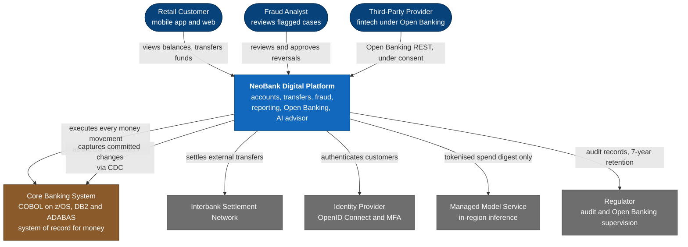

The brown box is the constraint the whole design is organised around: it cannot be changed, it
must not be bypassed, and it charges for every operation.

---

## 2. C4 Container

The major runnable pieces and the traffic between them. Placement follows principle **P9** —
regulated and core-adjacent work on-premises, elastic customer-facing work in the cloud.

The two environments are drawn separately so each stays legible in print. They meet at one
place only: the private link, shown as a boundary node in both halves.

### 2.1 Cloud environment

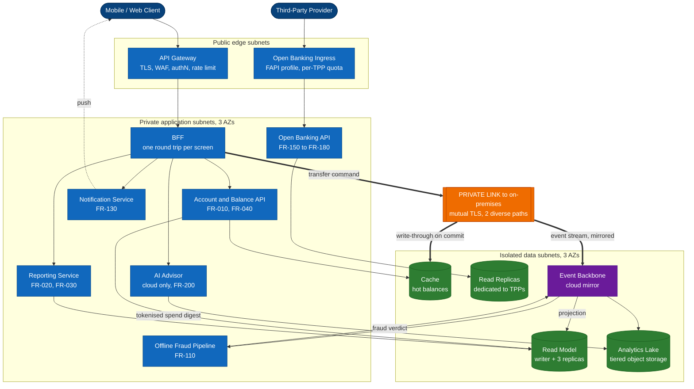

Everything here is read-only or read-mostly, none of it holds authoritative money state, and
none of it has a route to the mainframe. That is what allows this half to be scaled elastically
and to carry a 99.999% target (NFR-010).

### 2.2 On-premises environment and the core

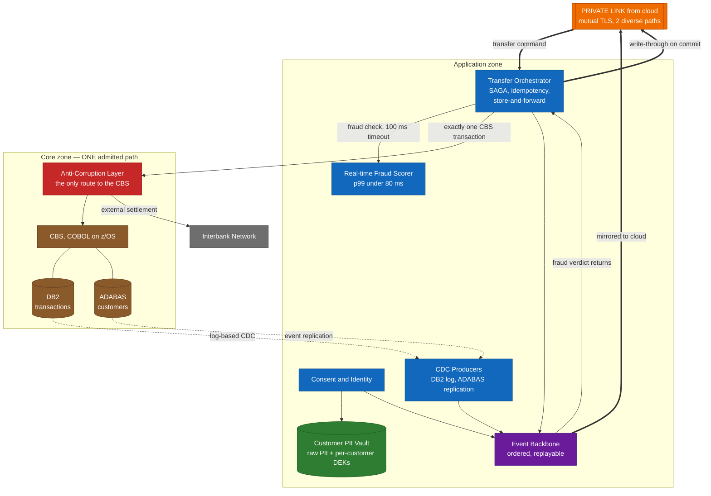

Three things are worth reading off these two diagrams together:

- **Nothing in the cloud half has a line into the core zone.** Reads never reach the mainframe
  (P2), which is what delivers both the latency target and the 93% reduction in mainframe
  operations.
- **Exactly one box touches the CBS**, and it is red. That is the anti-corruption layer (P3),
  and it is also the enforcement point for quota, idempotency and cost metering (P7).
- **The dotted lines out of DB2 and ADABAS are the whole data path.** Change data capture flows
  one way, out of the core and into the derived stores. Nothing flows back in except a
  transaction.

Consent enforcement and customer notification also cross the boundary; both are shown where they
belong, in the flow diagrams at §5.3, §5.4 and §5.5.

---

## 3. Data architecture

Where the truth lives, what is derived from it, and how long each copy is kept.

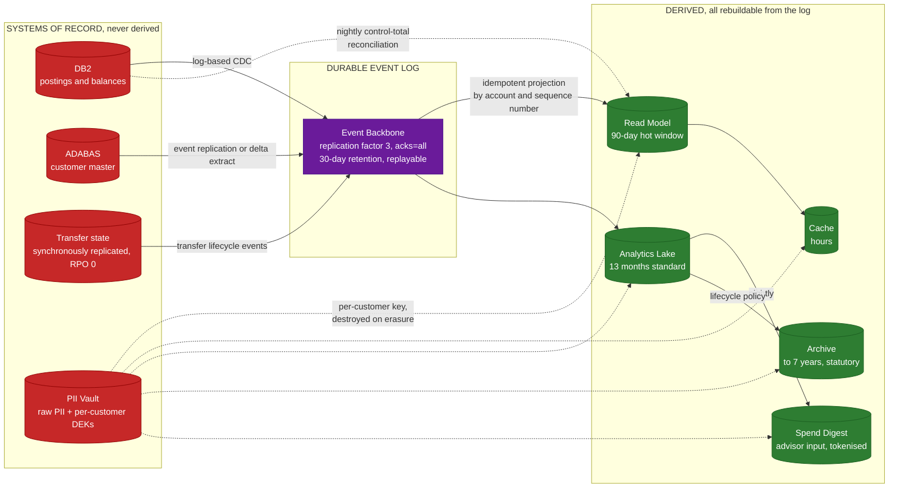

Red is authoritative and irreplaceable. Green is derived and can be deleted and rebuilt at any
time — which is exactly why the read path can be optimised as aggressively as it is. The purple
log is the hinge: it is what makes the green boxes reconstructible without ever asking the
mainframe a question.

The dotted lines from the vault are the erasure mechanism (§3.5.7). Every derived copy is
encrypted under the customer's own key, so destroying that one key renders all of them
unreadable at once — including backups and archives, which no row-level delete can reach.

---

## 4. Deployment and network topology

Trust boundaries, subnet tiers and the disaster recovery site.

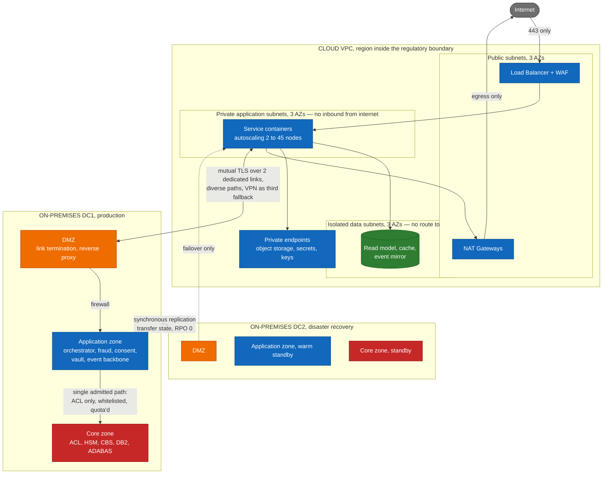

The isolated data subnets have no route to a NAT gateway, so a compromised database cannot call
out. The core zone admits exactly one source — the anti-corruption layer — which is what
NFR-280 requires and what makes the mainframe cost controllable as well as secure.

---

## 5. Flow diagrams

### 5.1 View account information and balance — FR-010, FR-040

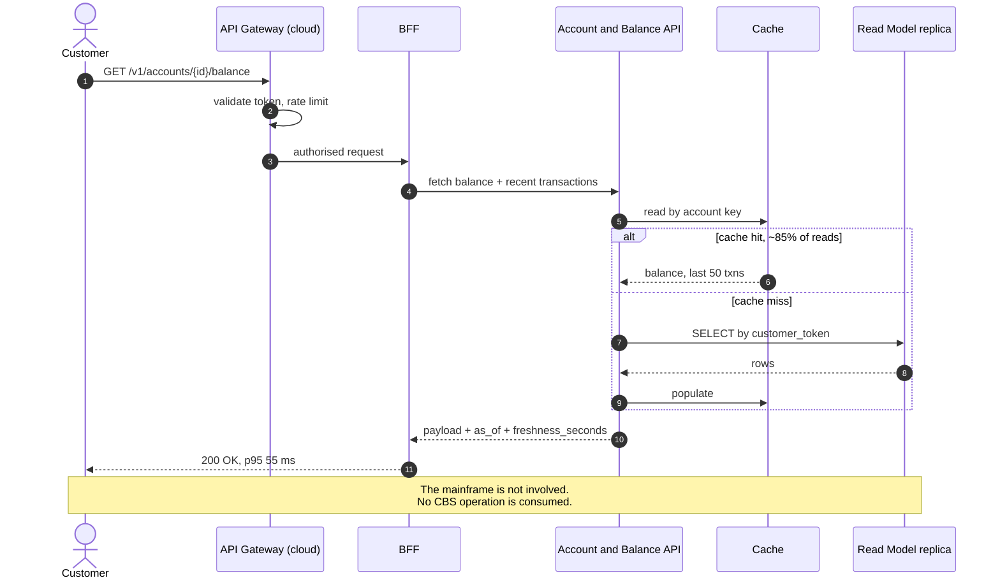

### 5.2 Transfer with real-time fraud check — FR-050 to FR-080, FR-100

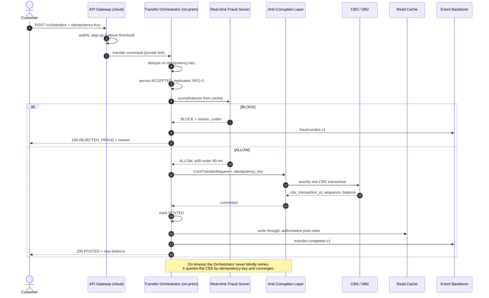

### 5.3 Offline fraud detection and compensating reversal — FR-110 to FR-130

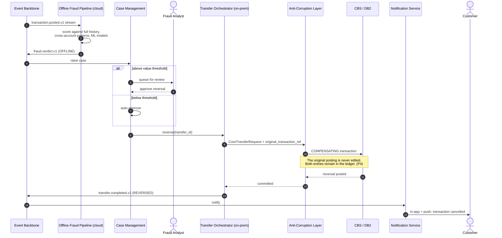

### 5.4 Open Banking request — FR-150 to FR-180

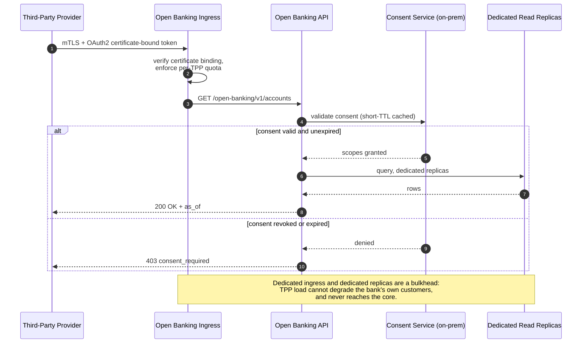

### 5.5 AI advisor consultation — FR-190 to FR-210

### 5.6 GDPR erasure — FR-240, NFR-270

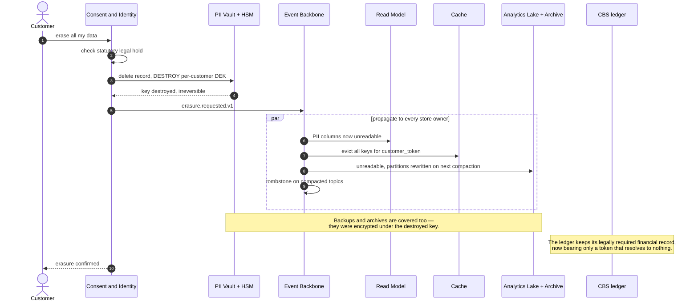

---

## 6. Transfer state machine

The lifecycle FR-090 requires the customer to be able to see at any moment.

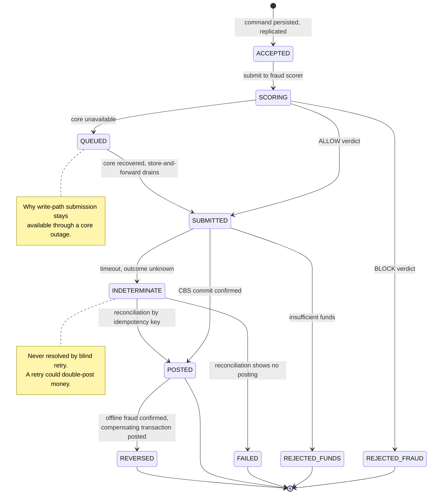

---

## 7. Scaling and cost view

Why the read path scales out and the write path deliberately does not.

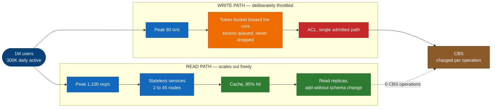

| | Reads | Writes |
|---|---|---|
| Year-3 peak | 1,100 req/s | 80 tx/s |
| CBS operations per month | 0 | 20,000,000 |
| Scaling response | Add nodes and replicas | Throttle, queue, and buy mainframe capacity only if genuinely needed |
| Marginal cost of growth | Low, and elastic | High, and charged per operation |

The asymmetry in the right-hand column is the whole argument. Reads are free to grow; writes
cost money every time, so the architecture spends its effort keeping the write count equal to
the number of times a customer actually moves money — and no higher.

---

**Editing.** These are text; edit the fenced blocks and they re-render. Preview at
<https://mermaid.live>. For the Word submission, `node tools/build-submission.mjs` renders every
block to PNG and embeds it in a single document; see `tools/export-diagrams.md` in the
repository root.
