# Diagrams — NeoBank *Digital Leap*

Structure views are drawn top-down; flow and pipeline views are drawn left-to-right or as
sequences.

Referenced throughout the [High Level Design](hld.md). Rationale for what these diagrams show is
in the [Decision Log](decisions.md).

---

## 0. Legend

One colour vocabulary applies to every diagram in this document. A shape means the same thing
wherever it appears.

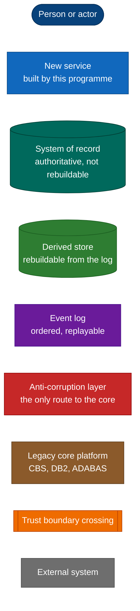

| Line style | Meaning |
|------------|---------|
| Solid arrow | Synchronous request or command |
| Thick arrow | Traffic crossing the cloud / on-premises boundary |
| Dotted arrow | Asynchronous data flow — change data capture, events, notifications |

---

## 1. C4 Context

Who uses the platform, and what it depends on.

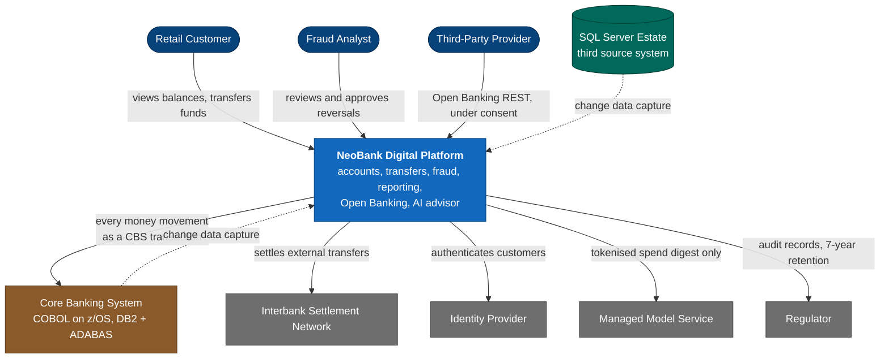

The brown box is the constraint the whole design is organised around: it cannot be changed, it
must not be bypassed, and it charges for every operation. **Three** source systems feed the
platform, not two — DB2 and ADABAS on the mainframe, and the SQL Server estate beside them
(§3.5.2, [A-18](hld.md#42-assumptions)).

---

## 2. Target platform vision

The layered view of the target estate — production and disaster recovery, cloud over
on-premises, all three source systems beneath the ingestion tier. This mirrors the structure set
out in the project brief and is the "big picture first" view; §3 onward decomposes it.

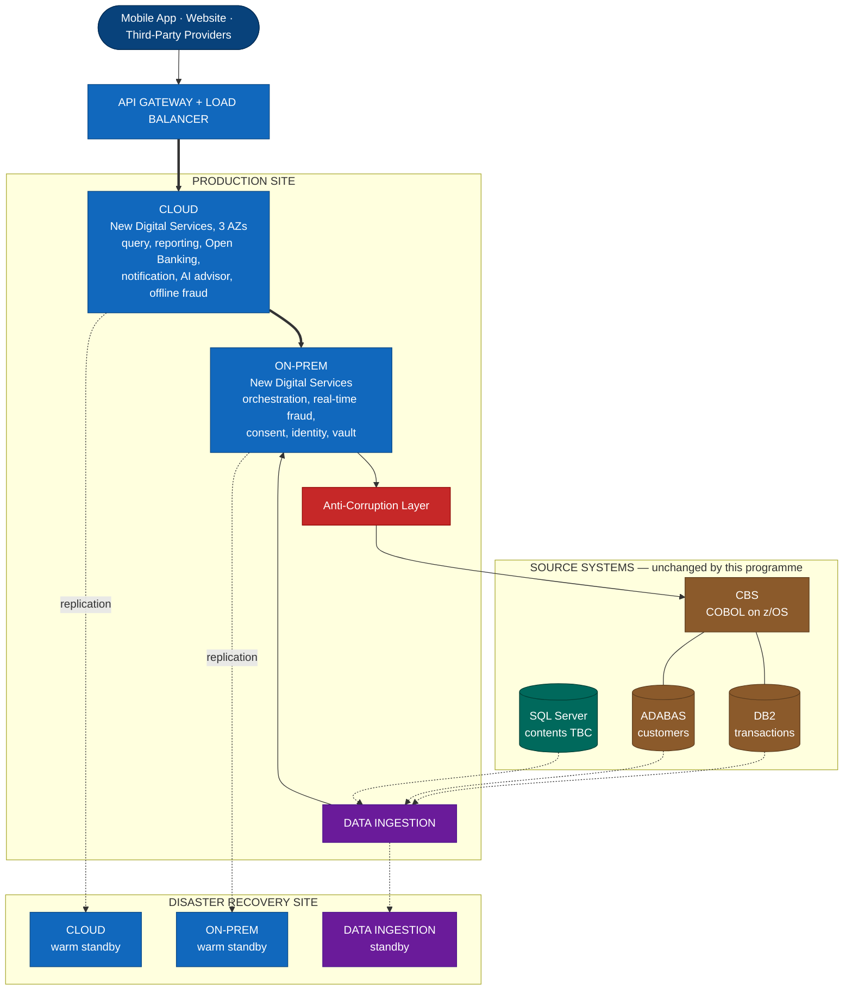

Two points where this design makes a deliberate choice rather than simply copying the target
picture. The disaster recovery site is a **warm standby**, not a symmetric hot estate — the
reasoning and the cost it avoids are in [D15](decisions.md#d15--disaster-recovery-posture).
And **every arrow into the core passes through the anti-corruption layer**, which the vision
does not name but which NFR-280 requires.

---

## 3. C4 Container

The major runnable pieces and the traffic between them. Placement follows principle **P9** —
regulated and core-adjacent work on-premises, elastic customer-facing work in the cloud. The two
environments are drawn separately so each stays legible in print; they meet only at the private
link, shown as a boundary node in both halves.

### 3.1 Cloud environment

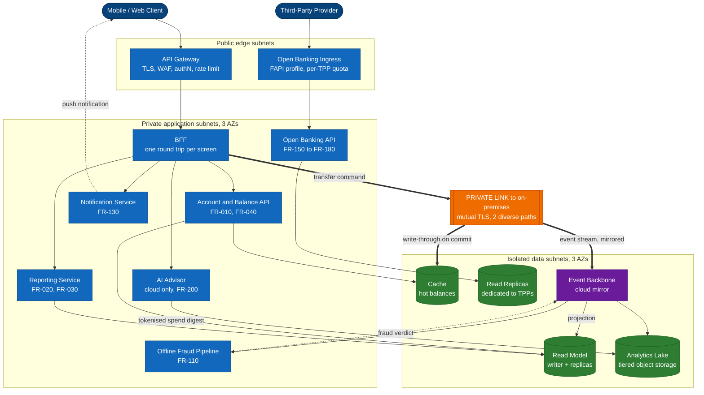

Everything here is read-only or read-mostly, none of it holds authoritative money state, and none
of it has a route to the mainframe. That is what allows this half to be scaled elastically and to
carry the full 99.999% system availability target (NFR-010, NFR-011).

### 3.2 On-premises environment and the core

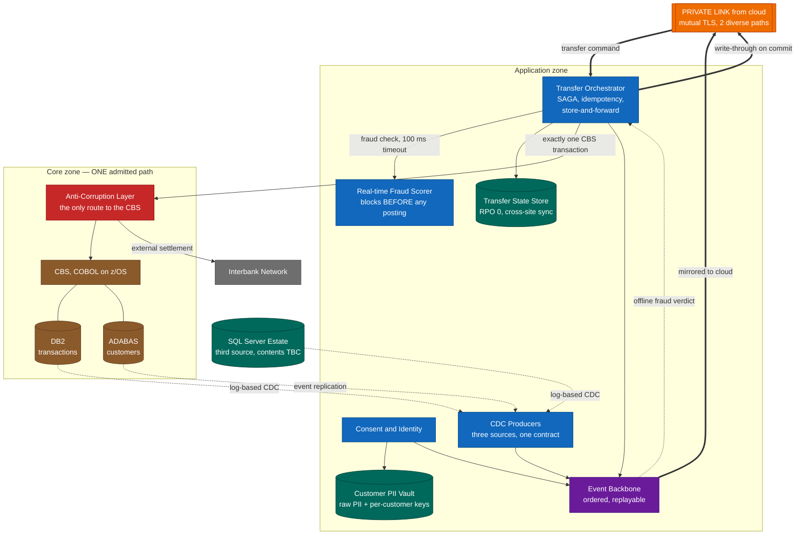

Three things are worth reading off these two diagrams together:

- **Nothing in the cloud half has a line into the core zone.** Reads never reach the mainframe
  (P2), which is what delivers both the latency target and the 93% reduction in mainframe
  operations.
- **Exactly one box touches the CBS**, and it is red. That is the anti-corruption layer (P3),
  and it is also the enforcement point for quota, idempotency and cost metering (P7).
- **The dotted lines out of DB2, ADABAS and SQL Server are the whole data path.** Change data
  capture flows one way, out of the sources and into the derived stores. Nothing flows back in
  except a transaction.

Consent enforcement and customer notification also cross the boundary; both are shown where they
belong, in the flow diagrams at §6.3, §6.4 and §6.5.

---

## 4. Data architecture

Where the truth lives, what is derived from it, and how long each copy is kept. Drawn
left-to-right because it is a pipeline.

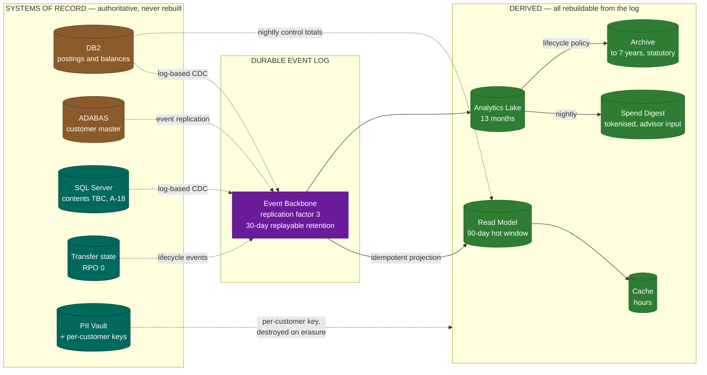

The left-hand group is authoritative and irreplaceable. The right-hand group is derived and can
be deleted and rebuilt at any time — which is exactly why the read path can be optimised as
aggressively as it is. The purple log is the hinge: it makes the derived stores reconstructible
without ever asking a source system a question.

The dotted line from the vault is the erasure mechanism (§3.5.7). Every derived copy is encrypted
under the customer's own key, so destroying that one key renders all of them unreadable at once —
including backups and archives, which no row-level delete can reach.

---

## 5. Deployment and network topology

Trust boundaries, subnet tiers and the disaster recovery site.

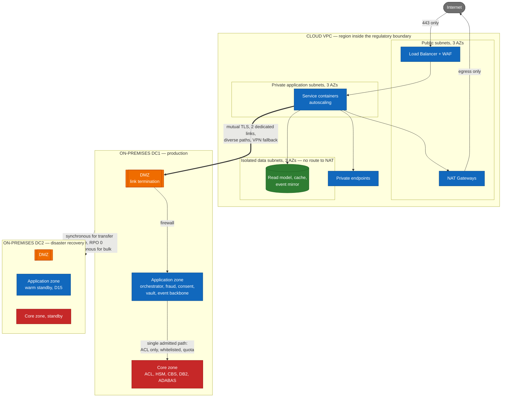

The isolated data subnets have no route to a NAT gateway, so a compromised database cannot call
out. The core zone admits exactly one source — the anti-corruption layer — which is what NFR-280
requires and what makes the mainframe cost controllable as well as secure.

---

## 6. Flow diagrams

### 6.1 View account information and balance — FR-010, FR-040

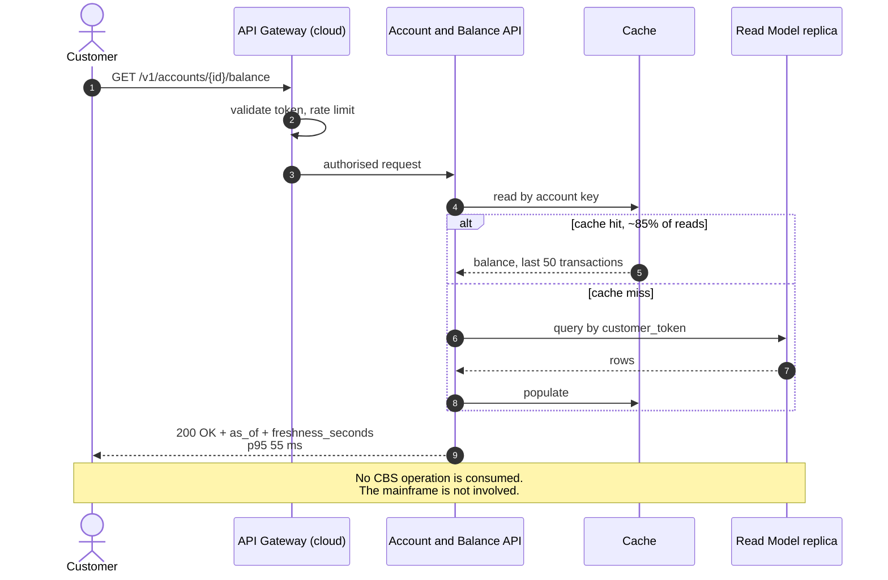

### 6.2 Transfer with real-time fraud check — FR-050 to FR-080, FR-100, FR-120

**This is the primary fraud-cancellation path.** A blocked transfer is rejected *before* any CBS
transaction is submitted, so nothing posts and no reversal exists.

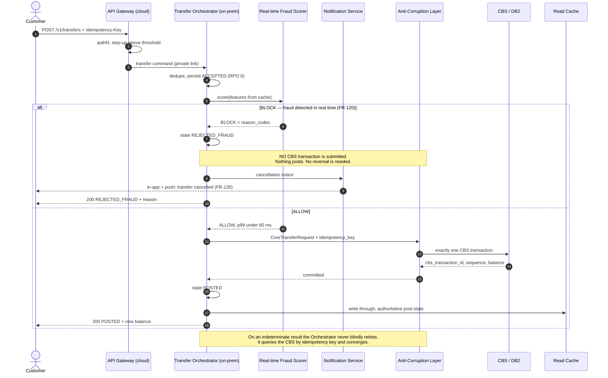

### 6.3 Offline fraud detected after posting — FR-110, FR-125, FR-130

**This is the exception path.** Compensation exists only for fraud the real-time budget could not
catch, where a posting already exists.

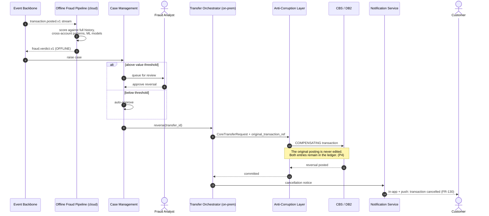

### 6.4 Open Banking request — FR-150 to FR-180

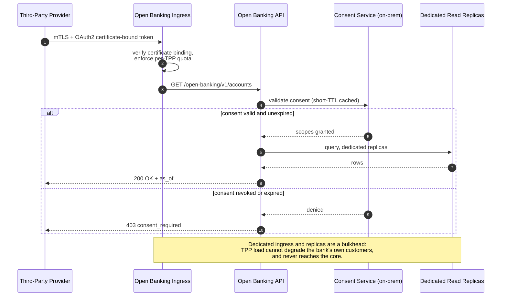

### 6.5 AI advisor consultation — FR-190 to FR-210

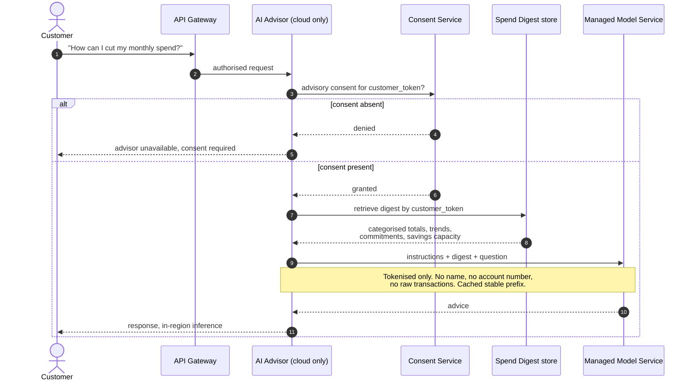

### 6.6 GDPR erasure — FR-240, NFR-270

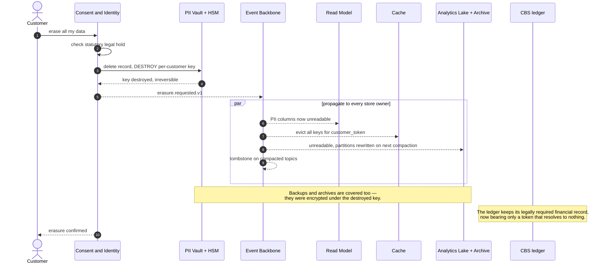

---

## 7. Transfer state machine

The lifecycle FR-090 requires the customer to be able to see at any moment. Note that
`REJECTED_FRAUD` is reached **without any posting**, while `REVERSED` is reached only from
`POSTED`.

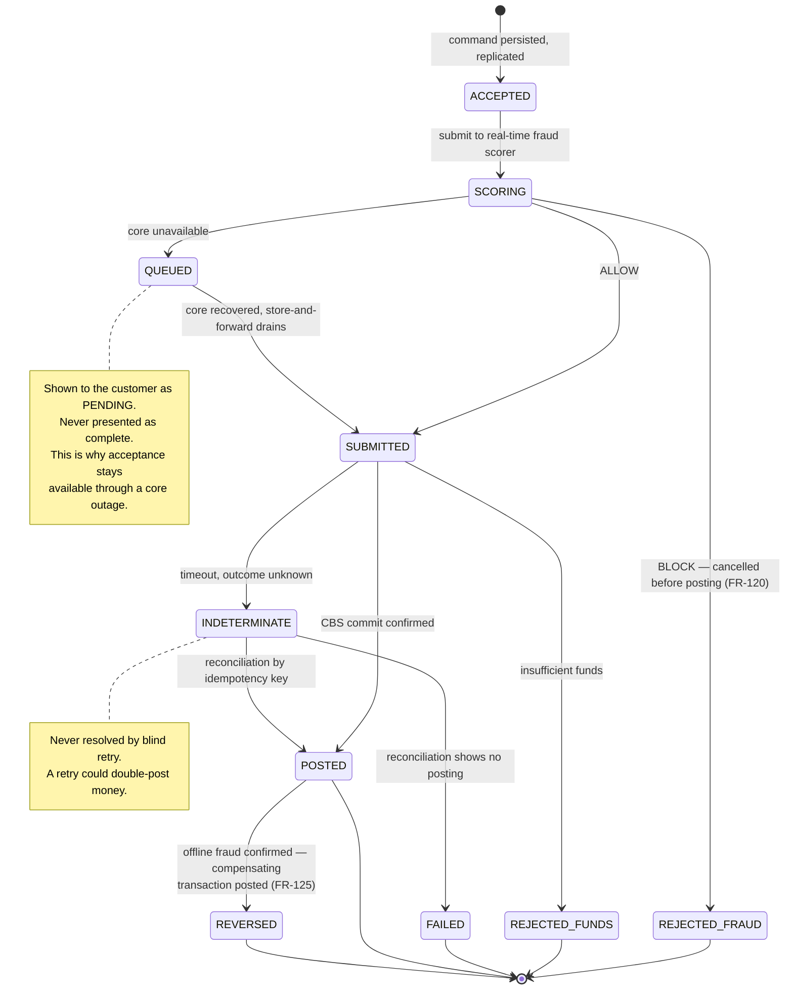

---

## 8. Scaling and cost view

Why the read path scales out and the write path deliberately does not.

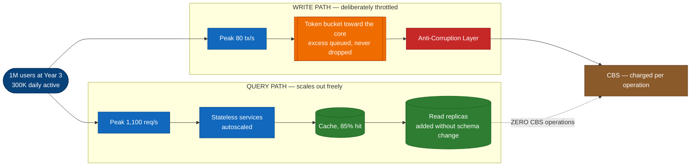

| | Queries | Writes |
|---|---|---|
| Year-3 peak | 1,100 req/s | 80 tx/s |
| CBS operations per month | 0 | 20,000,000 |
| Scaling response | Add nodes and replicas | Throttle, queue, and buy mainframe capacity only if genuinely needed |
| Marginal cost of growth | Low and elastic | Charged per operation |

The asymmetry in the right-hand column is the whole argument. Queries are free to grow; writes
cost money every time, so the architecture keeps the write count equal to the number of times a
customer actually moves money — and no higher.
